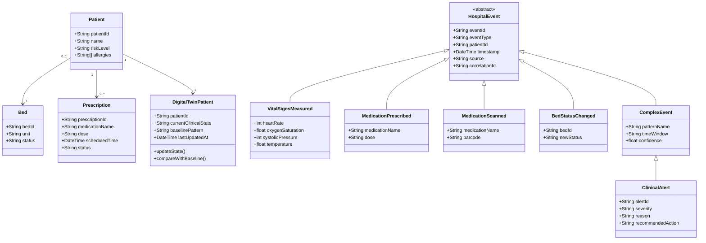
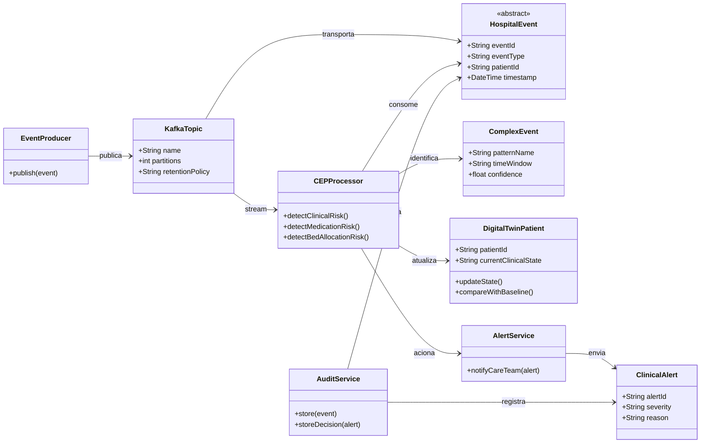
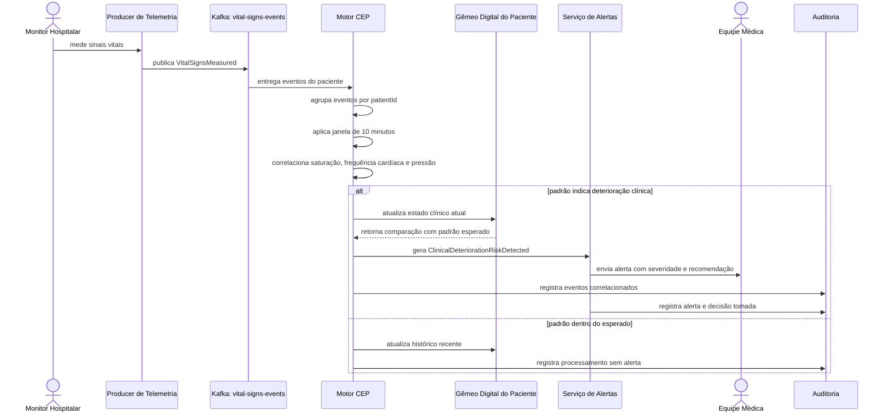

# Processamento de Eventos Complexos em Saúde Hospitalar

## Cenário e Contexto
O sistema proposto é uma plataforma de monitoramento hospitalar em tempo real para pacientes críticos em pronto-socorro e UTI. A ideia é apoiar a equipe médica na identificação rápida de situações de risco, como piora clínica, erro medicamentoso e demora na alocação de leitos.

Em um hospital, muitos dados são gerados o tempo todo: sinais vitais, prescrições, exames, movimentação de pacientes, ocupação de leitos e ações da equipe. Se esses dados forem analisados apenas depois, em relatórios ou sistemas em lote, várias decisões importantes chegam tarde demais. Por isso, o CEP faz sentido nesse contexto: ele permite correlacionar eventos simples dentro de janelas de tempo e transformar esses sinais em eventos complexos que indicam uma situação relevante para o negócio hospitalar.

A proposta não é substituir a decisão médica, mas criar uma arquitetura que ajude a detectar padrões de risco, gerar alertas e manter um gêmeo digital do paciente atualizado com seu estado clínico mais recente.

## 1. Identificar

### Contrato dos Eventos

Cada evento precisa ter um contrato claro para que possa ser processado de forma confiável. A estrutura base usada na solução é:

| Campo | Descrição |
| --- | --- |
| `eventId` | Identificador único do evento |
| `eventType` | Tipo do evento gerado |
| `patientId` | Identificador do paciente |
| `timestamp` | Momento em que o evento ocorreu |
| `source` | Origem do evento, como monitor cardíaco, prontuário ou sistema de leitos |
| `payload` | Dados específicos do evento |
| `confidence` | Grau de confiança da leitura, quando aplicável |
| `correlationId` | Identificador usado para correlacionar eventos relacionados |

Essa estrutura ajuda a diferenciar telemetria simples de um evento complexo de negócio, além de permitir rastreabilidade e auditoria.

### Eventos Simples

| Evento simples | Origem | Exemplo de dado |
| --- | --- | --- |
| `VitalSignsMeasured` | Monitor multiparamétrico ou wearable hospitalar | Frequência cardíaca, pressão, saturação, temperatura |
| `MedicationPrescribed` | Prontuário eletrônico | Medicamento, dose, horário e médico responsável |
| `MedicationScanned` | Leitor de código de barras ou app da enfermagem | Medicamento que será administrado |
| `MedicationAdministered` | App da enfermagem | Confirmação de administração |
| `LabResultAvailable` | Sistema laboratorial | Resultado de exame |
| `BedStatusChanged` | Sistema de gestão de leitos | Leito livre, ocupado, em limpeza ou bloqueado |
| `PatientLocationChanged` | Sistema hospitalar ou pulseira RFID | Pronto-socorro, UTI, sala de exame |
| `ClinicalNoteCreated` | Prontuário eletrônico | Observação feita por médico ou enfermagem |

### Eventos Complexos

Eventos complexos surgem quando eventos simples são correlacionados por tempo, condição e contexto clínico.

| Evento complexo | Correlação usada | Ação esperada |
| --- | --- | --- |
| `ClinicalDeteriorationRiskDetected` | Saturação em queda + frequência cardíaca alta + pressão instável em uma janela de 10 minutos | Gerar alerta para equipe assistencial |
| `MedicationRiskDetected` | Medicamento escaneado + alergia registrada + prescrição ativa + dados do paciente | Bloquear ou pedir validação antes da administração |
| `CriticalPatientWaitingForBed` | Paciente crítico + ausência de leito disponível + tempo de espera elevado | Priorizar alocação de leito |
| `UnexpectedClinicalPatternDetected` | Sinais vitais fora do padrão histórico do paciente | Atualizar gêmeo digital e solicitar avaliação |
| `DelayedCareRiskDetected` | Exame crítico liberado + ausência de ação clínica após limite de tempo | Notificar equipe responsável |

### Regra ECA

Um exemplo de regra Event-Condition-Action:

- **Evento:** novas medições de sinais vitais chegam continuamente.
- **Condição:** saturação abaixo de 90%, frequência cardíaca acima de 120 bpm e pressão sistólica abaixo de 90 mmHg dentro de 10 minutos.
- **Ação:** gerar o evento complexo `ClinicalDeteriorationRiskDetected`, atualizar o gêmeo digital do paciente e enviar alerta para a equipe.

## 2. Modelar

### Arquitetura Proposta

A solução usa uma arquitetura orientada a eventos. Os sistemas hospitalares e sensores atuam como produtores de eventos. Esses eventos entram em tópicos Kafka e são processados por serviços consumidores, incluindo um motor CEP responsável por detectar padrões complexos.

### Tópicos Kafka

| Tópico | Produtores | Consumidores |
| --- | --- | --- |
| `vital-signs-events` | Monitores, wearables, sensores de leito | CEP, gêmeo digital, painel clínico |
| `medication-events` | Prontuário, app da enfermagem, leitor de código de barras | CEP, serviço de segurança medicamentosa |
| `lab-results-events` | Sistema laboratorial | CEP, prontuário, painel médico |
| `bed-management-events` | Sistema de leitos | CEP, central de regulação |
| `patient-location-events` | RFID, app hospitalar | CEP, gêmeo digital |
| `clinical-alerts-events` | Motor CEP | App médico, painel da UTI, auditoria |
| `dead-letter-events` | Kafka/serviços de validação | Equipe técnica e reprocessamento |

### Visões da Arquitetura

| Visão | Aplicação na solução |
| --- | --- |
| Empresa | Reduzir tempo de reação clínica, evitar eventos adversos e melhorar uso de leitos |
| Informação | Eventos padronizados com contrato, carimbo temporal e identificadores de correlação |
| Computação | Producers, Kafka, CEP, consumidores, serviço de alerta e gêmeo digital |
| Engenharia | Alta disponibilidade, baixa latência, segurança, observabilidade e reprocessamento |
| Tecnologia | Kafka, stream processing, banco temporal, API hospitalar e painel em tempo real |

A modelagem estática foi dividida em duas visões para melhorar a leitura. A primeira apresenta o domínio hospitalar e os tipos de eventos usados na solução. A segunda apresenta os componentes responsáveis pelo processamento em tempo real. As duas visões se complementam e representam a mesma solução, apenas separadas para evitar um diagrama muito carregado.

### Diagrama UML Estático - Domínio e Eventos

### Diagrama UML Estático - Processamento

### Diagrama UML Dinâmico

## 3. Decidir

### Decisões de Engenharia

A arquitetura precisa equilibrar tempo de resposta, segurança dos dados e confiabilidade. Como o domínio é hospitalar, não basta detectar um evento; é necessário explicar de onde ele veio, quais dados foram correlacionados e por que um alerta foi gerado.

As decisões abaixo foram avaliadas considerando atributos de qualidade importantes para o sistema, como latência, disponibilidade, segurança, rastreabilidade e privacidade. A ideia é deixar claro o benefício de cada escolha e também o seu custo, porque uma arquitetura em tempo real sempre envolve trade-offs.

| Decisão | Justificativa |
| --- | --- |
| Usar Kafka como broker de eventos | Permite ingestão contínua, desacoplamento entre sistemas e processamento paralelo |
| Particionar eventos por `patientId` | Mantém a ordem dos eventos de um mesmo paciente e facilita correlação clínica |
| Usar janelas temporais no CEP | Ajuda a diferenciar uma leitura isolada de um padrão real de risco |
| Criar DLQ para eventos inválidos | Evita que dados corrompidos parem o fluxo principal |
| Atualizar um gêmeo digital por paciente | Permite comparar o estado atual com o histórico individual |
| Registrar trilha de auditoria | Garante rastreabilidade entre evento, alerta e decisão clínica |
| Aplicar criptografia e controle de acesso | Protege dados sensíveis de saúde e reduz risco de exposição |

### Trade-offs

| Decisão | Benefício | Trade-off |
| --- | --- | --- |
| Processar eventos em tempo real | Reduz tempo de resposta clínica | Aumenta complexidade operacional |
| Usar janelas curtas, como 5 a 10 minutos | Detecta riscos rapidamente | Pode gerar mais falsos positivos |
| Usar gêmeo digital individual | Melhora precisão da análise | Exige armazenamento histórico confiável |
| Processar parte dos dados próximo à origem | Reduz latência | Aumenta a necessidade de governança nos dispositivos |
| Auditar todos os eventos relevantes | Facilita explicação e revisão | Aumenta volume de dados armazenados |

### Ciclo de Feedback do Gêmeo Digital

O gêmeo digital do paciente é atualizado a cada novo evento relevante. Quando o CEP identifica um padrão de risco, o estado atual do paciente é comparado com seu histórico recente e com seus dados clínicos conhecidos. Depois que a equipe médica toma uma ação, essa decisão também fica registrada na auditoria. Com isso, o sistema cria um ciclo de feedback: evento recebido, padrão detectado, alerta gerado, ação tomada e registro para análise posterior.

## Cenários de Negócio

### Cenário 1 - Detecção Precoce de Deterioração Clínica

Um paciente internado na UTI começa a apresentar queda gradual de saturação, aumento da frequência cardíaca e pressão instável. Cada leitura isolada pode não parecer suficiente para gerar uma ação imediata, mas a combinação desses dados em uma janela curta indica risco de deterioração.

O CEP identifica esse padrão e gera o evento complexo `ClinicalDeteriorationRiskDetected`. O gêmeo digital do paciente é atualizado e o alerta é enviado para a equipe responsável.

**Como melhora a eficiência:** reduz o tempo entre o início da piora clínica e a ação da equipe, evitando que a decisão dependa apenas de uma verificação manual tardia.

### Cenário 2 - Prevenção de Erro Medicamentoso

Uma enfermeira escaneia um medicamento antes da administração. O sistema cruza esse evento com a prescrição ativa, alergias registradas, dose esperada e estado atual do paciente.

Se o medicamento escaneado não estiver compatível com a prescrição ou apresentar risco por alergia, o CEP gera o evento `MedicationRiskDetected`. Nesse caso, o sistema solicita validação antes da administração.

**Como melhora a eficiência:** evita retrabalho, reduz risco ao paciente e cria uma barreira automática antes que o erro chegue à execução.

### Cenário 3 - Otimização de Leitos para Pacientes Críticos

Um paciente grave chega ao pronto-socorro e precisa de UTI. Ao mesmo tempo, outro paciente tem alta prevista, um leito entra em limpeza e outro está bloqueado. Esses eventos existem em sistemas diferentes, mas precisam ser analisados juntos.

O CEP correlaciona prioridade clínica, status dos leitos e tempo de espera. Quando identifica uma oportunidade de alocação, gera o evento `CriticalPatientWaitingForBed` e recomenda priorização.

**Como melhora a eficiência:** diminui o tempo de espera de pacientes críticos e melhora o uso de recursos hospitalares sem depender apenas de acompanhamento manual.

## Fechamento

A solução proposta usa CEP para transformar dados hospitalares dispersos em eventos úteis para decisão. O foco não está apenas em coletar dados, mas em correlacionar sinais no tempo certo, identificar situações críticas e apoiar a equipe com alertas rastreáveis.

O sistema combina eventos simples, eventos complexos, tópicos de streaming, modelagem UML, gêmeo digital e decisões arquiteturais voltadas para baixa latência, segurança e confiabilidade. Com isso, o contexto de saúde deixa de ser apenas um exemplo e passa a ser um caso realista em que o processamento de eventos pode melhorar tanto a eficiência operacional quanto a segurança do paciente.
